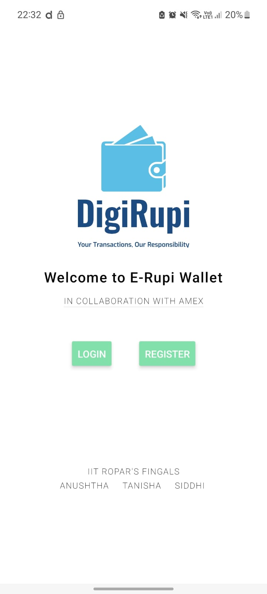
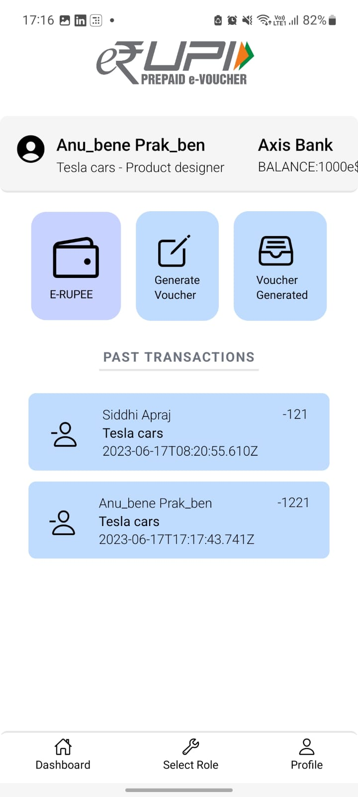
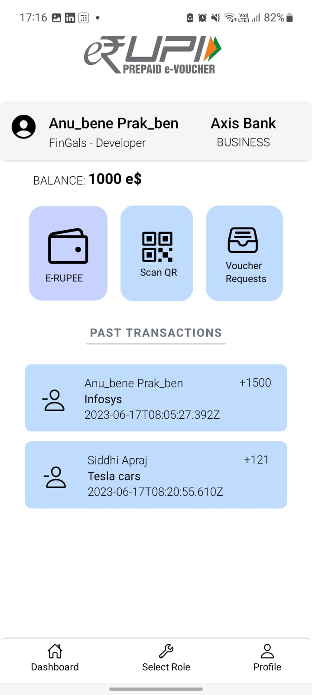
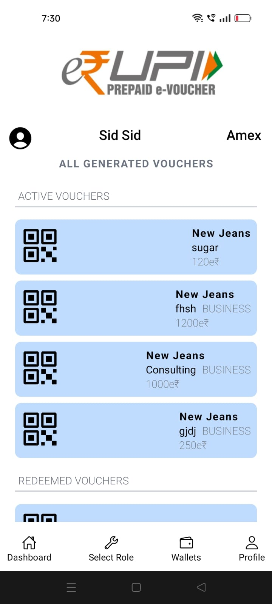
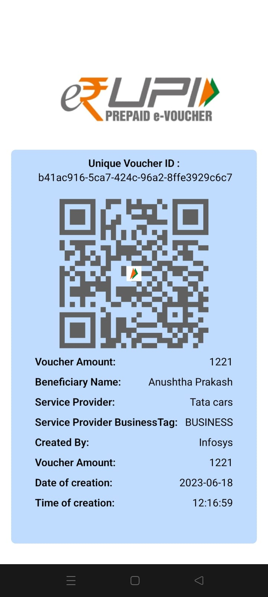

    

  <h1 align="center">DigiRupi App</h1>
     
    
  

Introducing our user-friendly Digital Wallet App, providing a secure and convenient platform for seamless transactions. Track your transaction history, manage wallet balance, and easily transfer funds. Create and redeem e-Rupi vouchers with QR code scanning and integration with UPI apps. Safely store important documents and credit/debit card information. Our app prioritizes security with encryption and biometric authentication. Connect with banks and NPCI effortlessly. Join us and experience the future of digital payments with our comprehensive solution.

## Table of Contents

- [Overview](#overview)
- [Features](#features)
- [System Requirements](#system-requirements)
- [Installation](#installation)
- [Contributers](#contributers)

## Overview

The Digital Wallet App is a React Native application with an AWS Amplify backend. It utilizes Prisma as the ORM tool for seamless interaction with a PostgreSQL database. The app offers a user-friendly interface for managing digital wallets, enabling users to add funds, initiate transactions, and view transaction history.

## Features

- **User Authentication**: Users can authenticate themselves using OTP, biometric authentication, recaptcha, and a wallet PIN for secure access to the app during Registration.
- **E-RUPI Integration**: The app integrates with the e-RUPI payment gateway, enabling users to transact seamlessly with other payment systems.
- **Encryption**: All sensitive information, including personal data and transaction details, is encrypted to ensure privacy and security.
- **Access Control**: The app implements robust access control mechanisms, enabling different user roles such as beneficiaries, service providers, and private organizations, with the ability to have multiple roles simultaneously.
- **Wallet Functionality**: Users can add funds to their digital wallets, check account balances, transfer e-rupee, redeem vouchers, and view available government and private sponsorships or e-rupi vouchers.
- **Dynamic Mode**: Users can switch between different modes of app usage, such as consumer, private business, or service provider, based on their specific needs.
- **In-App Alerts**: The app provides timely updates and alerts for voucher usage, voucher requests, and payment receipts.
- **Database Integration**: Private organizations can create databases of affected beneficiaries, and service providers can maintain a list of services offered.
- **QR Scanner and Generator**: App provides a facility to create a QR with necessary information about the voucher as well as a facility to scan the voucher to redeem it.
- **Voucher Transactions**: The app allows service providers to create and distribute vouchers that can be securely redeemed within the app, while also enabling companies and organizations to create personalized vouchers for individuals, with a scanning feature for fast redemption.
- **Client-Side Encryption**: The application provides robust client-side encryption to safeguard all sensitive user data with enhanced security measures.

## System Requirements

To run the Digital Wallet App, ensure that your development environment meets the following requirements:

- `Node.js` (v14 or higher)
- `Expo CLI`
- `Prisma CLI` (v3 or higher)
- `AWS Amplify CLI`

## Installation

- Make sure you have Git and Node.js installed on your computer.
- Clone the repository by running the following command:
  <pre><code>
    git clone <repository-url>
  </code></pre>
- Install Expo CLI globally by running the following command:
  <pre><code>
   npm install -g expo-cli
  </code></pre>
- Install the app dependencies by running the following command:
   <pre><code>
    npm install
  </code></pre>
- Start the Expo development server:
  <pre><code>
   expo start
  </code></pre>
- Download and install the Expo app on your mobile device from the App Store or Google Play.
- Scan the QR code displayed in the terminal using the Expo app.
- The app will compile and launch on your mobile device, allowing you to test and develop locally.

## App Screenshots

Here are some screenshots of our DigiRupi App:

   

  
  
  

  
  

<h2 id="contributers">Contributors</h2>

  <strong>
    <a href="https://github.com/anushthaPrakash">Anushtha Prakash</a> &emsp;
    <a href="https://github.com/tanishadaharwal">Tanisha Daharwal</a> &emsp;
    <a href="https://github.com/SiddhiApraj7">Siddhi Apraj</a> &emsp;
  </strong>

